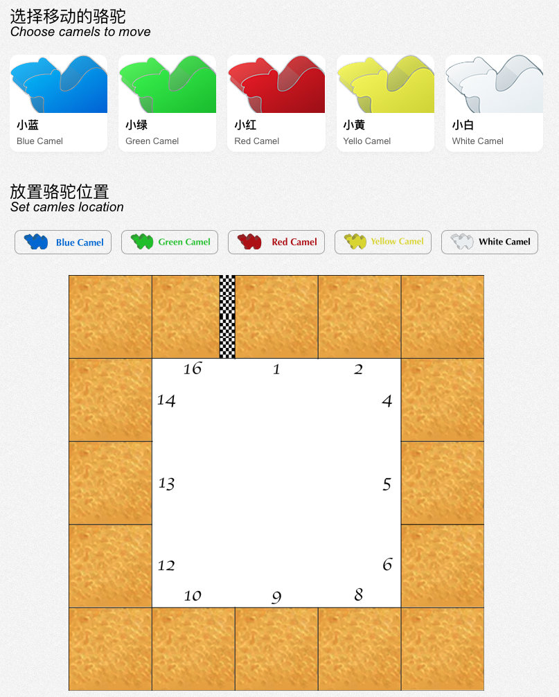
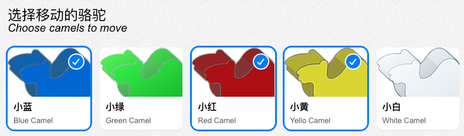
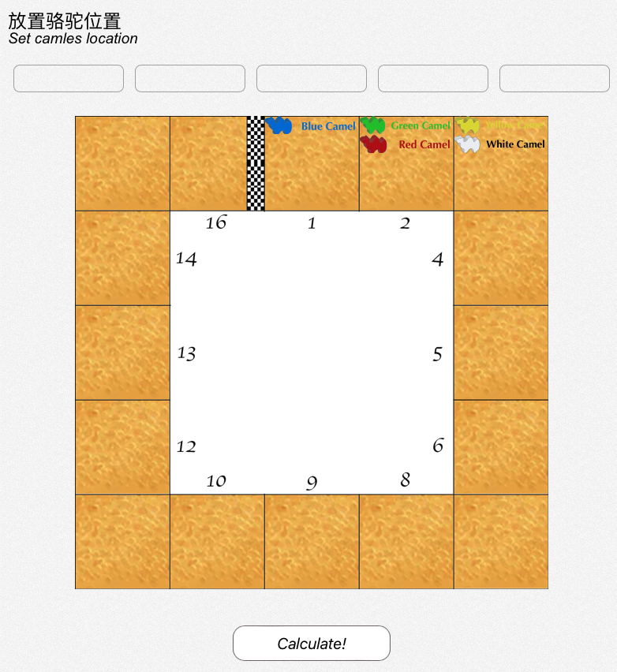
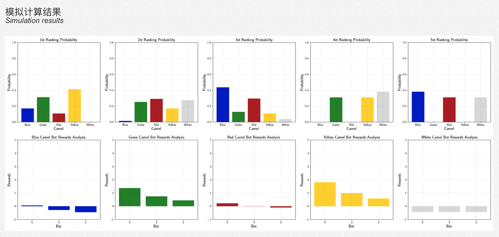

## 🐪 Camel Up Calculator

This is a tool to calculate the probability and expectation in the board game *Camel Up*. This tool can help you do a "perfect" decision when you are playing the game.


### 💡 Introduction

- About the *Camel Up*: *In Camel Up, up to eight players bet on five racing camels, trying to suss out which will place first and second in a quick race around a pyramid. The earlier you place your bet, the more you can win — should you guess correctly, of course. Camels don't run neatly, however, sometimes landing on top of another one and being carried toward the finish line. Who's going to run when? That all depends on how the dice come out of the pyramid dice shaker, which releases one die at a time when players pause from their bets long enough to see who's actually moving!* (from [Board Game Geek of Camel Up](https://boardgamegeek.com/boardgame/153938/camel));
- About this calculator: the Camel Up is a game with high randomness, so even though we follow the analysis probability and exceptions to play the game, we may not win. But we are still quarious about the competition between a guy who play the game with a theority analysis and another guy who just play the game for fun randomly. So, I create this small tool to provide the chance to test this guess. I trust that no one will really use this tool to play the game, this will make you feel boring; 
- About this repository: I create this toy project to learn how to use the Flask. 

### ⚙️ Environment

This tool is implemented by Python as the backbone with some basic packages and the Flask to make the web interface. Run `pip install -r requirements.txt` in the root path of this repository to install requirement packages.

### 🔧 Repository Structure

```
.
├── fig/ -- figure for readme
├── src/ -- python script to calculate the probability is here
│   └── leg.py
├── static/ -- resource for the web interface
│   ├── fig/
│   ├── js/
│   └── stylesheets/
├── templates/ -- html for the web interface
│   ├── index.html
│   └── result.html
└── run.py -- launch script for the Flask
```

### 📦 Quick Start

1. [Clone](git@github.com:cbhua/tool-camel-up.git) or Download this repository;

2. Install python requirements by running `pip install -r requirements.txt`;

3. Launch the web server by running `python run.py`;

4. Open your brower, open the page [http://localhost:5000](http://localhost:5000), then you can see the following page, ... or you launch this in your remote server, you can access the page with `http://your_server_ip:5000`. 
   
   - The outer link is allowed by default, for safety, if you don't want this, just remove `host='0.0.0.0'` in line 41 of the `run.py`;

   - The default port is `5000`, if you want to modify this, it's in the line 41 of the `run.py`

5. Choose camels who is going to move:
   

6. Drag camels to where they are in the map:
   

7. Clik the Calculation, then the calculator will open a new page to show you the simulation result:
   
   - The first line of the result is the probability of each camle to be the 1st, 2nd, 3rd, 4th, and 5th;
   - The second line of the result is the rewards of each camel by buying the 5 coins bet, 3 coins bet, and 2 coins bet. If the reward is larger than 0, it means you will earn money from this bet, or you will loss money. 

### 🧮 Algorithm

There are two functions in the `src/leg.py`, which are `simulate()` and `theory()`:

- `simulate()` function will based on the current status of the game to randomly run 1000 times simulation on the camel and use a statistic way to calculate the probability of each camle to be the 1st. With a small number of simulation, this function runs faster;
- `theory()` function will theoritically analyze the probability of each camel to be the 1st. This function runs slower when all of 5 camels will move; 

### ☑️ Develop Plan and Bugs

The biggest problem of using the statistic method is that we can not get a proper rewards for the overall winner or loser. Since the variance is huge that by a commen way we can not calculate it. So my idea is that can we apply the **reinfocement learning** here? This might be the next step. If you are intereste at this topic, please feel free to dicsuss and contribute, we need your help. 

And if you find some bugs in the code, please feel free to raise an issue or pull request. Welcome to contribute. 

